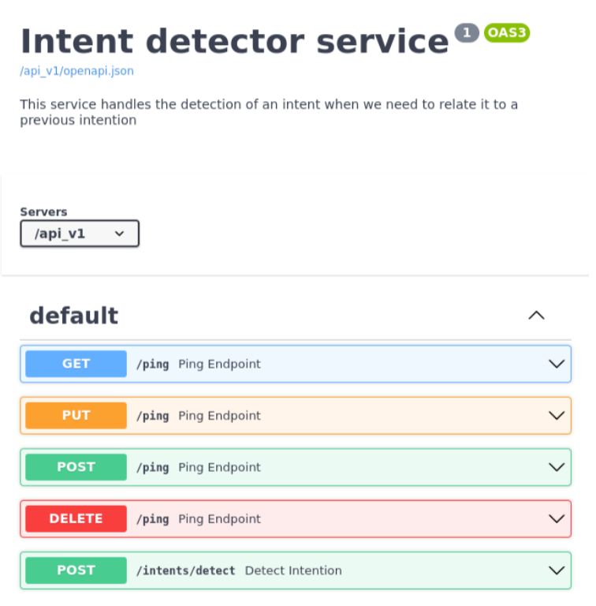
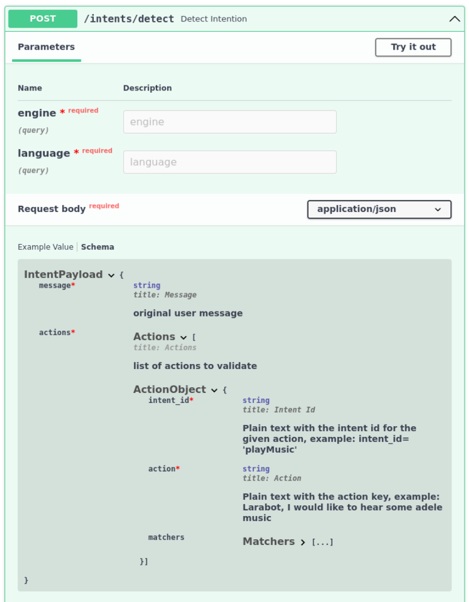
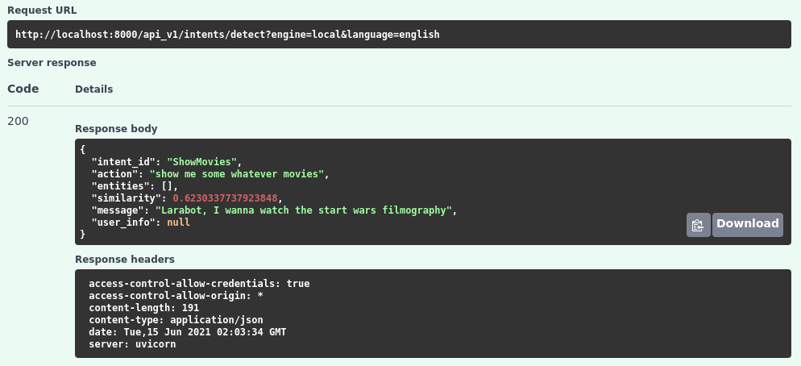
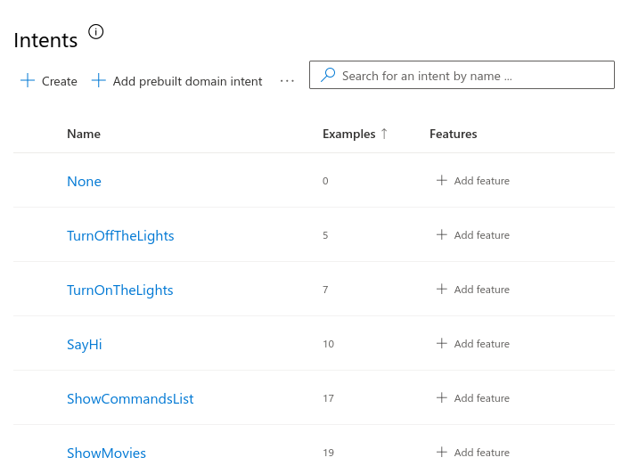
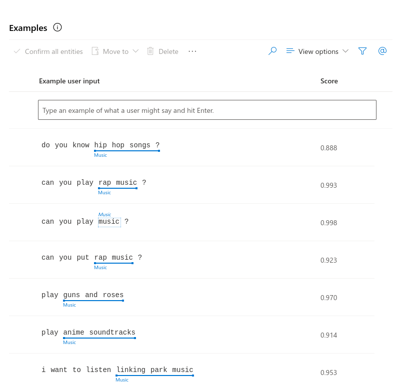

# Intent detector service

---

The **Intent detector service** module is the central module of the system and in which part of the current system 
architecture differs from other traditional chatbot architectures. This module abstracts the process of identifying 
intentions in the *controllers* (in a typical bot architecture) for making a process of formalizing the message using 
NLP techniques implemented as services. 

This module is essential to detect the intention, entities and relevant information of the message to be used in #BotEndine.
This service was implemented as a proof of concept to understand the needs and problems that could arise for its 
subsequent implementation.

## Structure

---
In this case, this microservice was created with **FastAPI** to simplify its construction and not depend on databases
or other resources and thus only specify an API. This proof-of-concept service uses a local engine along with a Luis.ai
implementation to obtain intents (and easy identification of entities). The local engine uses a Word2Vec model 
pre-trained and implemented with the Spacy tool and NLTK.

The documented endpoints can be found under `/api_doc/v1`. As an initial develop the available endpoints are:
- `/ping` for testing that the service is available
- `/intents/detect` for identifying intents.



This service has an endpoint to test, based on a list of actions with intentions, the probability with which the 
delivered message corresponds to an intent. In the current state the endpoint implements one of the cognitive services 
based on the engine parameter, this is achieved with the `Factory design pattern`. 

The service is fully implemented in English following good development practices (the content in Spanish is only used 
for training or execution of identification of intentions / entities in that language). It should be noted that the 
structures of the data used for the test are subject to change. 



### Running with docker
For running the service locally you can do it using `docker-compose up`, be sure to have the `8000` port available or
change it in the docker-compose.yaml

### Running locally

1. Installing poetry 
```bash
curl -sSL https://raw.githubusercontent.com/python-poetry/poetry/master/get-poetry.py | python -
```
2. Install the project's dependency:
```bash
poetry install
```
3. Finally, the service can be run with:
```bash
poetry run scripts/env.sh uvicorn intent_detector_service.app:app --host 0.0.0.0 --port 8000 --reload
```

*Bear in  mind that the service needs two local downloaded models for the local engines, these are auto-downloaded in the
docker version but for local testing you will need to do it manually.*

# Example

---
The followed is an example for testing the `api/v1/intents/detect` using the **local engine** with the **english** 
language:

```json
{
  "message": "Larabot, I wanna watch the start wars filmography",
  "actions": [
    {
      "intent_id": "PlayMusic",
      "action": "play some music",
      "matchers": []
    },
    {
      "intent_id": "SayHi",
      "action": "Hi, how are you?",
      "matchers": []
    },
    {
      "intent_id": "ShowMovies",
      "action": "show me some whatever movies",
      "matchers": []
    }
  ]
}
```

Using the bash:

```bash
curl -X 'POST' \
  'http://localhost:8000/api_v1/intents/detect?engine=local&language=english' \
  -H 'accept: application/json' \
  -H 'Content-Type: application/json' \
  -d '{
  "message": "Larabot, I wanna watch the start wars filmography",
  "actions": [
    {
      "intent_id": "PlayMusic",
      "action": "play some music",
      "matchers": []
    },
    {
      "intent_id": "SayHi",
      "action": "Hi, how are you?",
      "matchers": []
    },
    {
      "intent_id": "ShowMovies",
      "action": "show me some whatever movies",
      "matchers": []
    }
  ]
}'
```

Output result:
```json
{
  "intent_id": "ShowMovies",
  "action": "show me some whatever movies",
  "entities": [],
  "similarity": 0.6230337737923848,
  "message": "Larabot, I wanna watch the start wars filmography",
  "user_info": null
}
```

Swagger view:


## Cognitive services

---
### Luis.ai
For this first version the service implements `luis.ai` cognitive service. In case you want to implement you own service
you must create a new `luis.ai` instance and train it with you own data, an example of this can be found in the
[scripts folder](/scripts/luis_scripts).

```json
{
  "intent_list": [
    "PlayMusic",
    "SayHi",
    "TellAJoke",
    "ShowMovies",
    "ShowCommandsList",
    "TurnOnTheLights",
    "TurnOffTheLights"
  ],
  "entities": [
    {
    "name": "Music",
        "children": []
    },
    {
        "name": "Movie",
        "children": []
    }
  ],
  "language": "english",
  "example_utterances": [
    {
      "text": "I would like to listen some arctic monkeys music",
      "intentName": "PlayMusic",
      "entityLabels": [
          {
              "startCharIndex": 25,
              "endCharIndex": 40,
              "entityName": "Music",
              "children": []
          }
      ]
    },
    {
      "text": "put relaxing music",
      "intentName": "PlayMusic",
      "entityLabels": [
          {
              "startCharIndex": 19,
              "endCharIndex": 41,
              "entityName": "Music",
              "children": []
          }
      ]
    },
    {
      "text": "turn on the music",
      "intentName": "PlayMusic",
      "entityLabels": []
    },
    {
      "text": "I wanna watch star wars filmography",
      "intentName": "ShowMovies",
      "entityLabels": [
          {
              "startCharIndex": 13,
              "endCharIndex": 22,
              "entityName": "Movie",
              "children": []
          }
      ]
    },
    {
      "text": "I want to see star wars filmography",
      "intentName": "ShowMovies",
      "entityLabels": [
          {
              "startCharIndex": 13,
              "endCharIndex": 22,
              "entityName": "Movie",
              "children": []
          }
      ]
    },
    {
      "text": "Show me any terror movie",
      "intentName": "ShowMovies",
      "entityLabels": [
          {
              "startCharIndex": 12,
              "endCharIndex": 24,
              "entityName": "Movie",
              "children": []
          }
      ]
    },
    {
      "text": "Can you show me the trailer of the amazing SpiderMan?",
      "intentName": "ShowMovies",
      "entityLabels": [
          {
              "startCharIndex": 31,
              "endCharIndex": 51,
              "entityName": "Movie",
              "children": []
          }
      ]
    },
    {
      "text": "Tell me a joke",
      "intentName": "TellAJoke",
      "entityLabels": []
    },
    {
      "text": "Hi",
      "intentName": "SayHi",
      "entityLabels": []
    },
    {
      "text": "Hello",
      "intentName": "SayHi",
      "entityLabels": []
    },
    {
      "text": "list of options",
      "intentName": "ShowCommandsList",
      "entityLabels": []
    },
    {
      "text": "list of commands",
      "intentName": "ShowCommandsList",
      "entityLabels": []
    },
    {
      "text": "turn on the lights",
      "intentName": "TurnOnTheLights",
      "entityLabels": []
    },
    {
      "text": "connect the lights",
      "intentName": "TurnOnTheLights",
      "entityLabels": []
    },
    {
      "text": "turn off the lights",
      "intentName": "TurnOffTheLights",
      "entityLabels": []
    },
    {
      "text": "disconnect the lights",
      "intentName": "TurnOffTheLights",
      "entityLabels": []
    }
  ]
}
```

Here is how it would look in the dashboard:

#### Intents


#### Entities


For running the training script you can do it with:
```bash
poetry run scripts/env.sh python scripts/luis_scripts/train_model.py
```